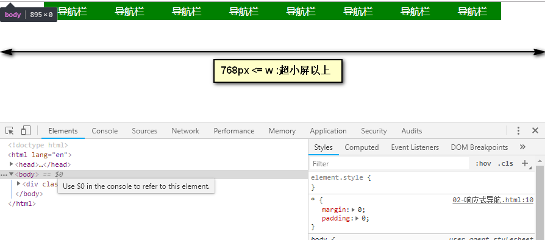
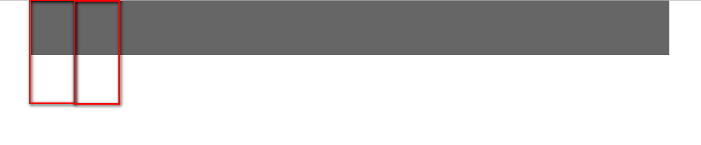
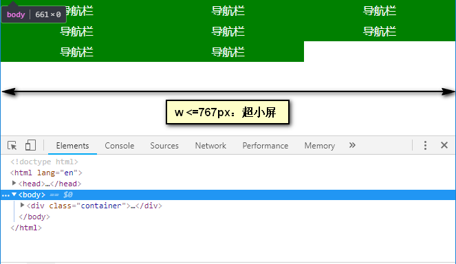
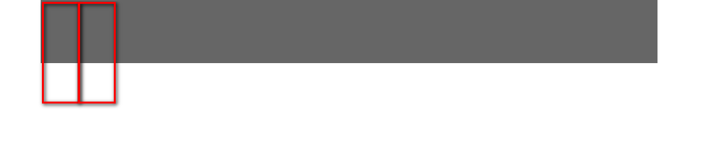
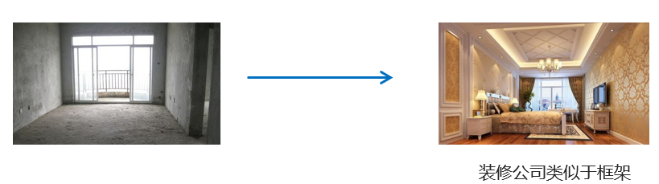

# flex布局

* flex布局是相比较传统布局（流式布局），**操作非常快捷**的布局；

# 1.介绍

* 了解flex布局、知道与传统布局的区别及应用场景；
* 对比：
  * 传统布局：
    * 兼容性好；布局繁琐；浮动，清除浮动；
    * 局限性，不能在移动端很好的布局；
  * flex布局：
    * 操作方便，**布局极其简单**，移动端使用比较广泛；
    * PC端浏览器支持情况比较差：l
* 使用：**如果是PC端页面布局，采用传统方式；如果是移动端或者是不考虑兼容的pc则采用flex；**

* 特点：flex 是 flexible Box 的缩写，意为"弹性布局"，用来为盒状模型提供最大的灵活性操作，
  * **任何一个标签都可以指定使用 flex 布局。**
  * 当为父盒子设为 flex 布局以后，**子元素的 float、clear 和 vertical-align 属性**将失效。
  * **使用思想上和传统盒子完全不同，不要再想是块级元素、行内元素等**，
  * flex通过行和列的思路来控制布局;
* 面试：flex布局又叫**伸缩  `布局 、弹性布局** 、**伸缩盒布局** 、**弹性盒布局 ；**
* 名称：
  * 采用 Flex 布局的元素，称为 Flex 容器（flexcontainer），父级简称"容器"。
  * 它的所有子元素自动成为容器成员，称为 Flex 项目（flexitem），简称"项目"。



* 语法：

```css
display:flex;
```


# 2.flex-容器属性

* flex布局的布局大部分属性设置，在于父级属性的设置；学好容器的属性关键属性，flex就学好了80%；

## 重点属性

* **确认主轴方向：flex-direction**
* **侧轴上子元素的排布：align-items（单行）**

## flex-direction！！！

* 改变主轴的选择，元素就是按照不同的主轴进行排布

* 坐标轴：


* 语法

```css
/* 确认主轴方向 */
/* row:行 （从左到右） 默认值 */
/* flex-direction: row; */
/* flex-direction: row-reverse; */
flex-direction:row /* 默认值 从左到右 */
flex-direction: column;
```


* 特点:
  * 默认：主轴： x 轴方向，水平向右；侧轴：是y 轴方向，水平向下；
  * 该属性是改变主轴的选择，即选择一个轴为主轴，另外一个自动成为侧轴；(这里说的并不是改变轴的指向)；
  * **当前元素会按照主轴的正方向 进行 排列**


## justify-content

* 单词justify：整理版面

* 控制**主轴上的元素**的对齐方式，类似word里的左对齐，右对齐，居中对齐，分散对齐；

* 语法值：


* **场景：space-around和space-between 比较常见；**

* 语法：控制主轴上元素排布方式

```css
      /* 主轴上 元素的排布方式 */
      /* flex-start:从头部开始排列 */
      /* justify-content: flex-start;  */
      /* justify-content: flex-end; */
      /* justify-content: center; */
      /* 均分剩余空间 */
      /* justify-content: space-around; */
      /* 剩余空间分在元素之间 */
      /* justify-content: space-between; */
```

## flex-wrap

* 控制子元素是否换行
* 语法：

```css
/* 不换行；子项目加起来的宽度超过父级的宽度时，子项宽度会被缩小，宽度只是不生效，必须设置 */
flex-wrap:nowrap;

/* 换行； 子项的总宽加起来超过父级宽度，就会换行*/
flex-wrap:wrap;
```

## flex-flow

* 复合属性：设置主轴与换行

* 语法：

```css
/* 复合属性：主轴 、换行 */
flex-flow: row wrap;
```


## align-items！！！

* 该属性是控制子项在 **侧轴（默认是y轴）**上的排列方，在子项为单项（单行）的时候使用；
* 整体一行元素看成整体，设置在侧轴上的对齐方式



* 语法：



```css
      /* 控制元素在侧轴上对齐方式，单行 */
      /* align-items: flex-start; */
      /* align-items: flex-end; */
      /* align-items: center; */
      /* stretch:拉伸，沿着侧轴方向上进行拉伸，侧轴方向上元素拉伸，设置子元素显示长度,高度属性必须关闭 */
      align-items: stretch;
```

* 特点：
  * stretch：侧轴方向上进行拉伸；

* **场景：**


```css
  <div class="box">
    <div class="img"></div>
    <span>info</span>
  </div>
  
.box {
  width: 100px;
  height: 100px;
  background-color: red;
  /* flex入口 */
  display: flex;
  /* 确认主轴 */
  flex-direction: column;
  /* 侧轴上对齐 */
  align-items: center;
}

.img {
  width: 50px;
  height: 50px;
  background-color: #fff;
  border-radius: 50%;
}
```


## align-content

* 设置子项在侧轴上的排列方式 ，并且只能用于子项出现 换行 的情况（多行）



* 语法：


* 多行在侧轴上的对齐，要看成一个整体；

```css
      /* 多行对齐：从头（侧轴）开始对齐 */
      /* align-content: flex-start; */
      /* align-content: flex-end; */
      /* align-content: center; */
      /* align-content: stretch; */
      /* align-content: space-around; */
      align-content: space-between;
```

* 特点：
  * align-content：需要设置换行；
  * space-around和 space-between：把多行都看成单独的整体，整体之间有剩余空间平分。
  * stretch：在侧轴方向上会拉伸；


## 重点案例

* 目标：做一个导航栏


- 分析：
  - 整体：
    - 确认主轴，水平向右；
  - 单独一个元素：
    - 整体单个元素：flex布局；
    - 确认主轴：Y轴，列；
    - 侧轴对齐：居中；


```css
  <div class="p">
    <div class="box">
      <div class="img"></div>
      <p>info</p>
    </div>
    <div class="box">
      <div class="img"></div>
      <p>info</p>
    </div>

  </div>
  
  
      /* 1.整体：flex布局，默认主轴方向 */
    
    .p {
      width: 500px;
      height: 100px;
      border: 1px solid #000;
      display: flex;
      /* flex-direction: row; */
    }
    /* 2.局部：flex布局，列排布，侧轴居中对齐 */
    
    .box {
      width: 100px;
      height: 80px;
      background-color: blue;
      /* flex */
      display: flex;
      /* 确认主轴：列 */
      flex-direction: column;
      /* 侧轴对齐 */
      align-items: center;
    }
    
    .img {
      width: 50px;
      height: 50px;
      background-color: #fff;
      border-radius: 50%;
    }
    
    p {
      margin: 0;
    }
```

# 3.项目属性

* 子项属性，单独控制元素所占剩余空间、侧轴排列方式、顺序等；

## 重点

* **flex：设置子项占有的份数；没有设置宽度高度，分配的剩余空间**

## flex！！！

* 划分剩余空间；
* 语法：

```css
.item {
    /* 默认值 0 flex来表示占多少份数，不设置宽高，在宽高方向全部进行剩余空间的划分*/
    flex: <number>; 
  /* 项目属性 flex：份数，整数值，把剩余空间分成一共多少份（项目份数要加起来），看各自占多少份*/
		/* flex: 1; */
    
    /* 分配剩余空间的百分比,使用%，必须加起来是100% */
    flex: 20%; 
}
```

* **使用场景：左侧固定，右侧随意拉伸；**


## align-self

* 控制子项，自己在侧轴上的 对齐方式；
* 父级元素上控制子项在侧轴的对齐方式：align-items 属性；
* 该属性允许单个项目有与其他项目不一样的侧轴上对齐方式，**可覆盖align-items 属性。**

* 语法：


```css
      /* 单独 侧轴上对齐 */
      align-self: flex-start; 
      /* 默认值：继承父亲 */
      align-self: stretch;
      
      /* 如果父亲不设置align-items ；默认值auto就为拉伸*/
	  	/* 如果父亲设置align-items ；默认值auto就为继承父亲的设置*/
      align-self:auto; 
      align-self: stretch; 
```

* 注意：
  * align-self默认值为 auto，表示继承父元素的 align-items 属性。
  * **但如果父级没有设置align-items，align-self的默认值为 auto就为strecth；**

* **使用：配合flex属性，主轴方向自动划分份数，侧轴方向自动拉伸；**


## order（了解）

* 属性定义子项目的排列顺序，数值越小，排列越靠前，默认为0。
* 可以设置为负数；注意和 z-index 不一样。这里是表示位数；

```css
.item {
    /*order: <number>;*/
  	order: -1;
}
```

## 圣杯布局案例



* 整体：主轴上这些元素可设置`flex:20%`，划分父级宽度；圣杯布局

```css
    .p {
      width: 500px;
      height: 100px;
      border: 1px solid #000;
      display: flex;
      /* flex-direction: row; */
    }
    /* 2.局部：flex布局，列排布，侧轴居中对齐 */
    
    .box {
      /* 项目属性 flex */
      /* flex: 1; */
      flex: 20%;
      /* width: 100px; */
      height: 80px;
      background-color: blue;
      
      /* 容器属性：本身又作为父亲，flex布局 */
      display: flex;
      /* 确认主轴：列 */
      flex-direction: column;
      /* 侧轴对齐 */
      align-items: center;
    }

    .img {
        width: 50px;
        height: 50px;
        border-radius: 50%;
        background-color: #fff;
    }
    p{
        margin: 0;
    }
```

# 4.携程网

* 熟悉flex布局，体验到flex布局的快捷
* 携程网链接：http://m.ctrip.com

## 构建文件目录


## 样式初始化

* 设置视口标签以及引入初始化样式

```html
<meta name="viewport" content="width=device-width, user-scalable=no,initial-scale=1.0, maximum-scale=1.0, minimum-scale=1.0">

<link rel="stylesheet" href="css/normalize.css">
<link rel="stylesheet" href="css/index.css">
```

* 4.常用初始化样式

```css
body {
  
  min-width: 320px;
  max-width: 540px;
  margin: 0 auto;
  color: #000;
  background: #f2f2f2;
}

```

## 页面实现

* 模块名字划分


## 线性渐变

* 以前只是一个颜色，现在可以出现渐变颜色；
* 语法：

```css
/* 起始方向，颜色1，颜色2，...*/
background: -webkit-linear-gradient(30deg, red, blue);
background-image: -webkit-linear-gradient(270deg, red, blue,yellow);
/* 1.必须有私有前缀*/
/* 2.起始方向：可以为方向名词left 或 deg度数，默认从上到下*/
/* 3.颜色个数：最少2两个颜色*/
```

径向渐变