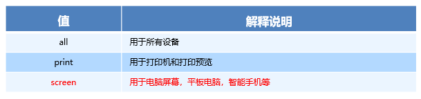

# rem 布局

* 流式布局、flex布局在宽度上控制的布局，高度写死；
* rem布局，最为直观的效果，页面全部元素现实**等比**缩放，包括文字，盒子大小；

# rem 单位

* rem单位，可以控制整个页面所有元素有关PX类；（宽、高、padding、margin、top...）只要是你设置数值的地方都可以实现控制；

## 语法

* root:   1rem=HTML的font-size大小；
* 语法：

```css
/* 1.根html 为 15px */
html {
   font-size: 15px;
}

/* 2.此时 div 的宽就是 100px */       
div {
    width: 10rem;
}
```

* 特点：绝对的唯一控制；


# 媒体查询

* 作用：响应屏幕的变化；

* 该可以根据屏幕不同的宽，从而获得不同的样式，然后实现不同的样式显示；

## 语法

* CSS3 新语法，是一个查询屏幕的过程，通过查询当前屏幕尺寸属于**哪个范围**，从而有**哪个范围**的样式生效；
* `mediatype  (media feature)` 都是它的查询条件

```css
@media mediatype and|not|only (media feature) {
    CSS-Code;
}
```

* mediatype：媒体类型；查询不同的终端设备 ； screen最为常用：查询当前设置的屏幕；



* and|not|only：关键字；将多个条件连接在一起共同查询；
  * **and**：可以将多个媒体特性连接到一起，相当于“且”的意思；最为常用；生活中：“我既要娶白富美，又要走上人生颠覆”；
  * not：排除 某个 媒体类型，相当于“非”的意思，可以省略。生活：“我喜欢看电影，除了恐怖片”；
  * only：指定某个特定的 媒体类型，可以省略。    生活：“我这辈子非你不嫁”；
* (media feature)：媒体特性；
  * 对于屏幕 screen，屏幕的宽度就是一个特性；


* 实例：
  * 查询条件加小括号；
  * min-width/max-width：最小界值，最大界值；查询条件包含等于号；

```css
/* 宽度的最小界值500px，大于等于500px */
@media screen and (min-width:500px) {
    body {
        background-color: red;
    }
}
```

## 档位划分

* 划分要求：
  * 档位1：w<540px      w <= 539px; 
  * 档位2:   540px<= w  and  w< 640px;
  * 档位3:  640px<= w 


* 语法实现：

```css
        @media screen and (max-width: 539px) {
            body {
                background-color: blue;
            }
        }
        @media screen and (min-width: 540px) and (max-width: 639px) {
            body {
                background-color: green;
            }
        }
        @media screen and (min-width: 640px) {
            body {
                background-color: red;
            }
        }
```

* 第二档位可简写为：

```css
        @media screen and (min-width: 540px) {
            body {
                background-color: green;
            }
        }
```

* 图示：


* 特点：划分屏幕，等待变化；

 ## 资源引入（了解）

* 语法：不常用

```html
<!-- 320px~640px -->
<link rel="stylesheet" href="style320.css" media="screen and (min-width: 320px)">
<!-- n>=640px -->
<link rel="stylesheet" href="style640.css" media="screen and (min-width: 640px)">
```


# rem+媒体查询 初体验

* rem布局的核心：rem+媒体查询；

## 等比!!!

* rem布局的效果是 等比，理解等比是我们学习的关键。
* 等比的效果：无论怎么发生等比变化，有一个比例一直是不变的；那么是哪个比例？

* 图示:


* 重点：
  * **图在宽度方向划分为三个基础块，缩放前后，相同份数；**
  * **其实分为几份没有关系，最为重要是缩放前后要份数相同；**
* 等比变化的核心：
  * **等比变化前后，宽高方向需要的份数相同，**
  * **基础块变化，整个就是等比缩放；**

## 初体验

* rem：唯一控制；只要用rem作为单位，**当 HTML字体大小发生改变，使用rem单位元素都会发生改变；**
* 媒体查询：把屏幕划分不同档位，等待变化；
* 加在一起：划分屏幕，等待变化；变化谁？变化唯一控制 rem（HTML字体大小）
* 语法：

```css
    @media screen and (min-width: 320px) {
      html {
        font-size: 50px;
      }
    }
    
    @media screen and (min-width: 640px) {
      html {
        font-size: 100px;
      }
    }
    
    .top {
      width:1.75rem;
      height:5.25rem;
    }
```

* rem布局的核心：
  * 媒体查询：屏幕到达不同的范围下，HTML的font-size大小会有不同的取值;
  * HTML 字体大小 = 1rem
  * rem：那么使用rem单位的元素就会发生等比的变化；


# less

* 从上面来看，我们需要计算，CSS没有计算功能；很多地方不方便复用 ；

## 介绍

* Less（Leaner Style Sheets 的缩写）是一门 CSS 扩展语言，它扩展了CSS的动态特性。 CSS 预处理器。
* 常见的CSS预处理器：Sass、Less、Stylus 。
* **预处理器**是[程序](https://baike.baidu.com/item/%E7%A8%8B%E5%BA%8F)中处理输入数据，产生能用来输入到其他程序的数据的程序。
* Less中文网址：[http://](http://lesscss.cn/)[less](http://lesscss.cn/)[css.cn/](http://lesscss.cn/)
* less : 让你写更少的代码，实现相同的效果；

## 安装

* 在线安装：
  * 搜索 Easy LESS 
  * 安装完毕插件，重新加载下 vscode。
  * 测试：保存一下 .less 文件，会自动生成 .css 文件。


* 离线安装：
  * 从本地安装
  * 重启
  * 测试


## 变量

* 变量是指没有固定的值，可以改变的。
* 我们CSS中的一些颜色和数值等经常使用，可以设置为变量；

* 语法：

```less
//@变量名:值;
@bg:#333;
.box_1 {
  background-color: @bg;
}

.box_2 {
  background-color: @bg;
}
```

* 命名规则：
  * 必须有@为前缀
  * 不能包含特殊字符~=+、不能以数字开头
  * 大小写敏感区分；

## 嵌套

* 类似HTML一样写LESS结构；
* 语法：

```css
/* css 写法 */
#header .logo {
  width: 300px;
}

/* less 写法 */
#header {
  .logo {
      width: 300px;
  }
}
```

* 交集|伪类|伪元素选择器，语法：

```css
/* css写法 */
a:hover{
    color:red;
}

/* less写法 */
a{
  &:hover{
      color:red;
  }
}
```


## 运算

* 任何数字、颜色或者变量都可以参与运算。
* Less提供了加（+）、减（-）、乘（*）、除（/）算术运算。
* 语法：

```less
// 数字
width: 200px - 50;

// 颜色
background-color: #666 - #222;

// 变量
@border: 5px;
border: @border solid red;

// 注意：运算符中间左右有个空格隔开 1px * 5
```

* 单位选择：
  * 如果两个值之间只有一个值有单位，则运算结果就取该单位
  * 对于两个不同的单位的值之间的运算，运算结果的值取第一个值的单位 


# rem+媒体查询+less 方案

* 初体验：rem+媒体查询 解读：不同屏幕，变化HTML的font-sizing大小；(基础块的改变)
* less能给我带来什么？计算：页面元素，HTML的font-sizing大小

* 问题：不同档位下的HTML font-size大小是怎么计算的？随便给的？

## 设计稿

* 尺寸不同，页面在不同的尺寸下要等比缩放


* 档位划分：min-width 最小界值；

```css
@no:10

// 320
@media screen and (min-width: 320px) {
    html {
        font-size:320px/@no;
    }
}
// 360
@media screen and (min-width: 360px) {
}
// 375 iphone 678
@media screen and (min-width: 375px) {
}
// 384
@media screen and (min-width: 384px) {
}
// 400
@media screen and (min-width: 400px) {
}
// 414
@media screen and (min-width: 414px) {
    
}
// 424
@media screen and (min-width: 424px) {
}
// 480
@media screen and (min-width: 480px) {
}
// 540
@media screen and (min-width: 540px) {
}
// 720
@media screen and (min-width: 720px) {
}
// 750
@media screen and (min-width: 750px) {
}
```

## font-size

* 基础块的大小，在各个档位内如何确认?
* 在这里，**我们约定设置HTML的字体大小：按照每个档位的最小界值，都划分相同的份数，得到当前档位的HTML的font-size大小；**
* 配合less，例如划分为20等份：

```css
// 我们此次定义的划分的份数 为 20  这个过程在计算 1个rem 在不同档位下是多大；
@no: 20;
// 320
@media screen and (min-width: 320px) {
    html {
        font-size: 320px / @no;
    }
}
@media screen and (min-width: 360px) {
    html {
        font-size: 360px / @no;
    }
}
```
