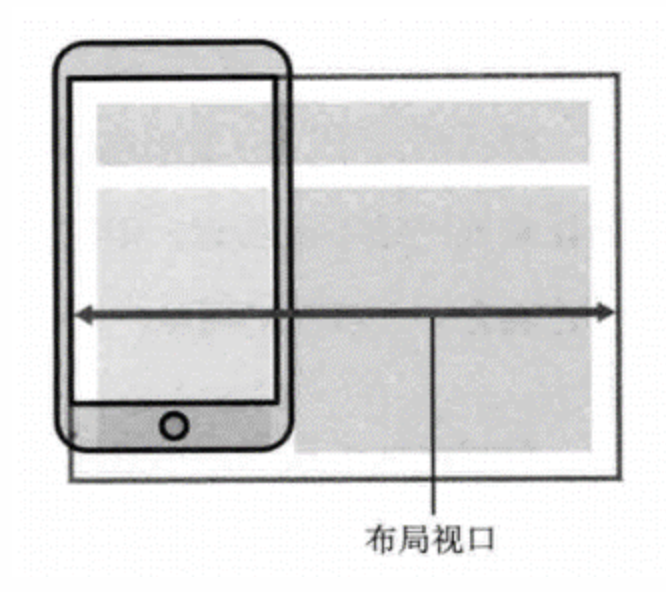
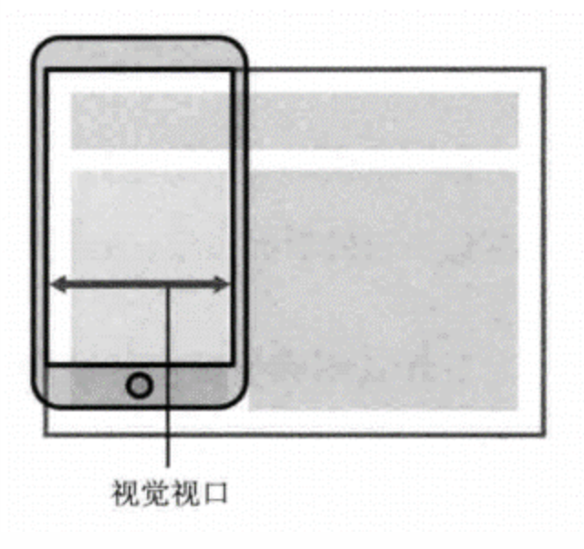
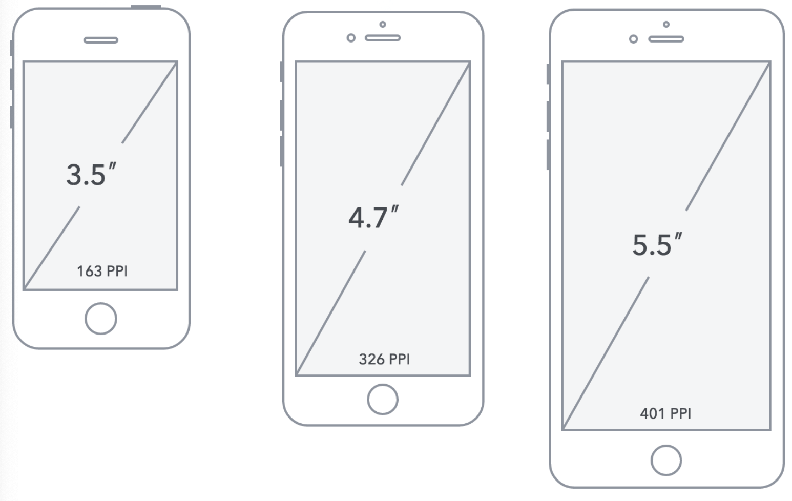
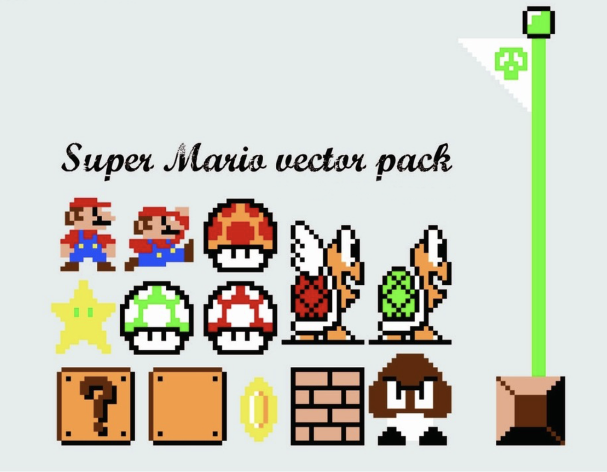
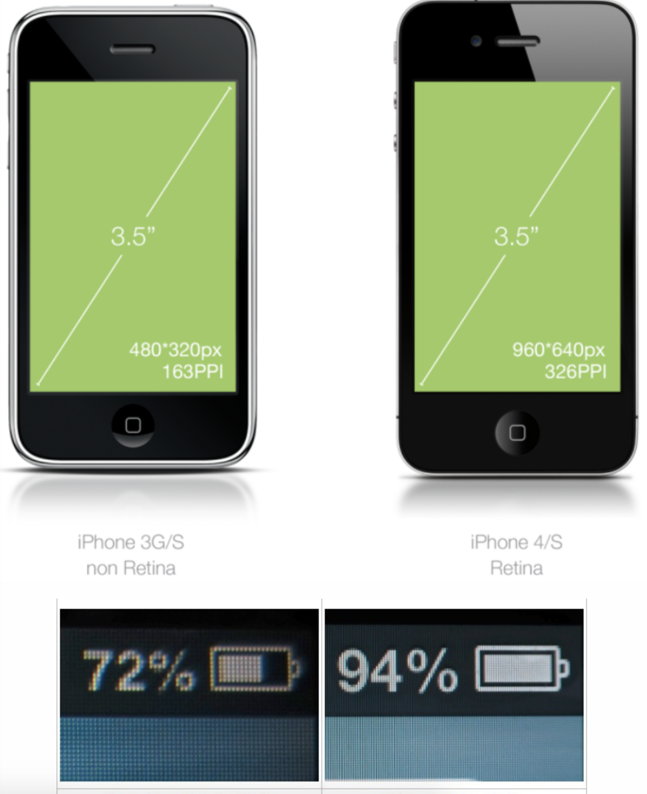
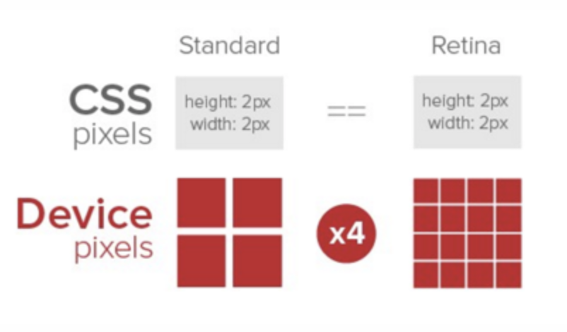
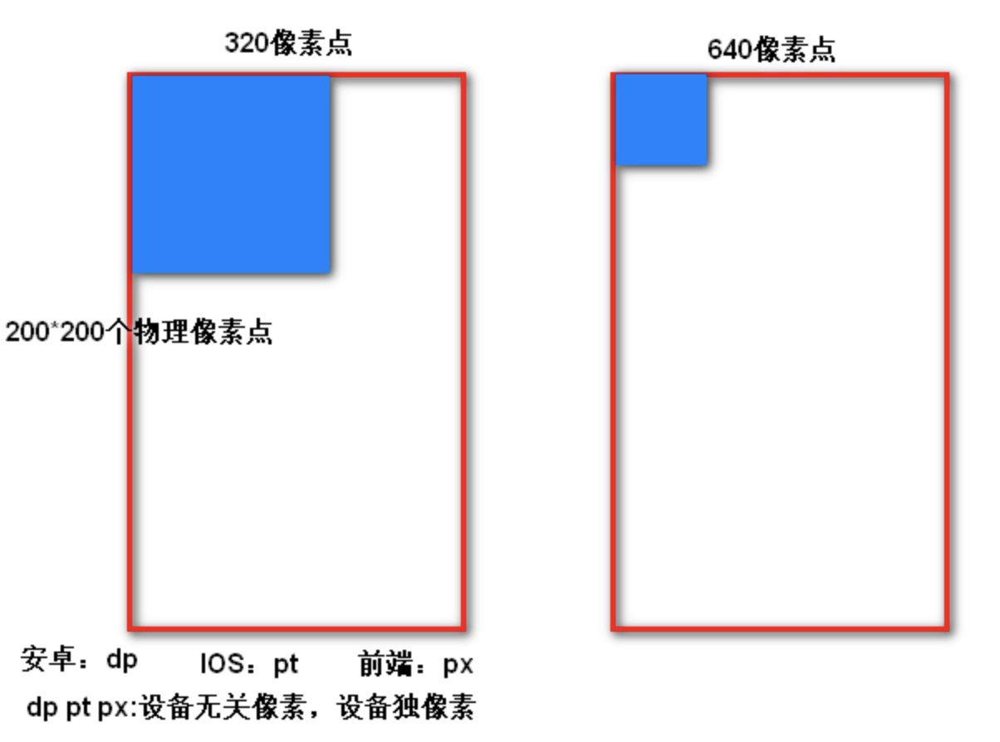
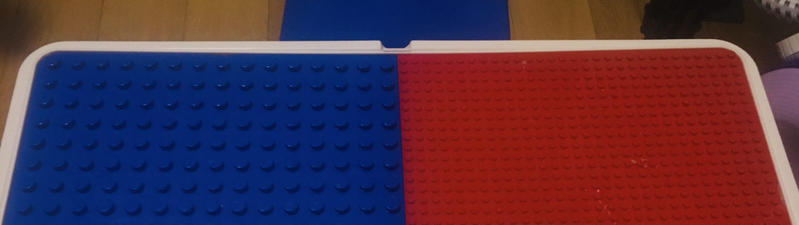

## 01-流式布局-介绍及移动端现状

* 内核：webkit；分辨率：碎片化；

* 流式布局是比较常用传统的布局方式，

* ##### 内核

  * 国产主流手机浏览器，内核 webkit，主要处理兼容目标。

* ##### 分辨率

  * 手机分辨率：**碎片化太多**
  * Android：480x800, 480x854, 540x960, 720x1280，1080x1920 等
  * iPhone：640x960, 640x1136, 750x1334, 1242x2208 等
  * 2K：手机分辨率


## 02-流式布局-调试·

* 是**开发过程中的主要模拟手段；**

##### 谷歌浏览器：

* 1.鼠标右键 检查 或 F12  控制器界面方向；
* 2.选择 手机模式
* 3.选择 手机类型及尺寸；调节适当的显示比例；
* 4.点右键 查看 页面元素；

##### 本地搭建访问

* 搭建本地web服务器，手机和服务器一个局域网内，通过手机访问我们自己搭服务器；
* 该测试阶段可在开发过程或者完成开发，本地局域网的真机调试；目的就是为了测试页面在真机内的效果；

##### 外网访问

* 使用外网服务器，直接IP或域名访问；
* 一般用于即将上线的模拟，测试真实环境的页面的展示效果；

## 03-流式布局-viewport

* 视口：浏览器（PC、移动端）显示页面内容的屏幕区域；不同的屏幕的大小，我们看到的区域也是不同的；PC端的页面直接放入手机屏显示，不友好
* viewport就是为了解决上面问题；

#### 设置前

* 手机浏览器浏览PC端页面：
  * 给HTML默认宽度 980px，页面初始化时百分百显示；但是页面元素是缩小；
  * 手指缩放，可以正常看见元素，但是内容超出；
* 原因：HTML默认为980px不是很合适；



那么设置HTML宽度多少为合适呢？我们眼睛能看到的，屏幕的窗口多大，设置多大就合适；




* 默认：HTML980px；
* 理想：手机屏幕多大，HTML就设置是多大；
* 语法：标准写法

```html
<meta name="viewport" content="width=device-width, user-scalable=no, initial-scale=1.0, maximum-scale=1.0, minimum-scale=1.0">
```

* 特点：width=device-width：让HTML宽度等于设备宽度；适配所有手机；
* **width=device-width：改变HTML默认的980px   为   屏幕的宽度；**
* user-scalable: 是否允许用户缩放屏幕  值：no(0不允许)   yes(1允许)；
* initial-scale：初始化缩放·比例；1.0：不缩放；
* maximum-scale：用户对页面的最大缩放比例；值：比例
* minimum-scale：用户对页面的最小缩放比例；值：比例

## 04-流式布局-二倍图-屏幕尺寸、物理像素点、屏幕分辨率

* 物理像素点：客观存在，一个点发光一个颜色；一个萝卜一个坑；
* 屏幕分辨率：水平和垂直方向上的物理像素点的个数；

##### 屏幕尺寸（了解）

* 通常我们所指的屏幕`尺寸`，实际上指的是屏幕对角线的长度（一般用英寸来度量）如下图所示
* 1英寸 = 2.54cm **绝对单位**；（到哪都不会变的值）



##### 物理像素点

* 早期的屏幕，物理像素点都比较大，比如玩游戏的超级玛丽的画面的颗粒感很强：随着技术的进步，物理像素点会被做的越来越小；会被做小；
* 指计算机显示设备中的最小单位，即一个像素点的大小。每一个像素点可以理解为就是屏幕上的一个发光点。每个点可以发一个颜色，就是我们看到的画面。



**大白话：一个萝卜一个坑：**

- 萝卜：光、颜色；
- 坑：物理像素点

##### 屏幕分辨率

* 屏幕分辨率：物理像素点的个数来衡量，表示屏幕水平和垂直方向的物理像素点的个数，”坑“有多少个；

* iPhone3和iPhone4是同一个屏幕尺寸下，比较分辨率：



* 坑会越做越小：直观感受，画面细腻；Retina（视网膜屏幕）是一种显示技术，可以将把更多的物理像素点压缩至一块屏幕里；从而达到更高的分辨率，并提高屏幕显示的细腻程度。
* ‘坑’特点：越做越小；（iPhone4坑的宽度是iPhone3坑的宽度一半）
* 

## 05-流式布局-二倍图-图片分辨率-CSS像素

* 图片分辨率：颜色发光点，在水平和垂直方向上有多少个；

* 各个手机显示一样大：设置CSSpx,向各个手机自动计算出背后需要多少个物理像素点，以保证每个手机显示一样大；

  ##### 图片分辨率

  * 图片都是有颜色，图片分辨率。图片分辨率就是带着“萝卜”来的；

  - 下图：分辨率640*426 ，提供了多少个色彩发光点（迎合物理像素点）；


* 到这，谁提供萝卜（图片），谁会提供坑（手机上物理像素点）；

* 假设：**有200*200分辨率**的图片，展示在宽度分别是320（iphone3）、640(iphone4)分辨率的手机上，展示的效果如下：

  

* 分析：
  * 200*200分辨率的图片：200个颜色发光点（萝卜）；
  * 一个物理像素点发一个颜色：一个萝卜一个坑，屏幕都需要200个物理像素点；
  * 坑的宽度大小：320（1）；640（0.5）；
  * 所以显示为上图。

* 问题：不同的屏幕下，显示的图片大小是不一样；
  * 宽度：第2个是第1个的0.5倍；
  * 面积：第2个是第1个的1/4倍；

* 目标：显示一样；

##### CSS像素px

* 解决：
  * 坑的宽度大小：i3（1）；i4（0.5）；
  * 坑的数量：320（1 x 200=200长度）、640(0.5 x 400=200长度）；都是200长度，才能保证显示的大小一样；

* 移动端：
  * 上面这个都是200长度到底如何设置呢？
  * 设置CSS 宽高200px后，会自动保证每个屏幕显示元素大小一样，
  * **会自动算出不同屏幕下，背后需要提供物理像素点需要多少个。**
  * 针对上面，每个手机会自动算出要给图片准备200个物理像素点、400个物理像素点；

## 06-流式布局-二倍图-由来及小结

* **命名：**
  - xxxxx@2x.png：二倍图
  - xxxxx@3x.png：三倍图
* 开始：设置CSS像素200px宽，320分辨率（200坑）,640分辨率（400坑）；这样才显示一样；
* 像针对640分辨率手机屏（iPhone4），要求设计给400*400图；对应我们CSS设置200px,有二倍的关系；
* 发现：虽然有二倍图这个概念，只是要求UI给我们二倍图，我们该怎么设置CSS还是怎么设置；

##### 小结

* 物理像素点：坑；
* 图片的颜色：萝卜；
* CSS px：
  * 设置的CSS px 后，在每个屏幕下，都是显示的大小是一样大的，实质背后就会算出不同的坑；
  * 设置CSS 50px：1倍屏50个，2倍屏100个；



## 07-流式布局-background-size

* 用图片做背景大小，不能设置图片大小，现在学习完二倍图，不设置CSS大小的话，图片按照原来的图片分辨率显示。
* 语法：

```css
/* 1.两个参数 ,可能会失去比例*/
background-size: 100px 100px; 
/* 2.单个参数 ，高度会等比适应*/
background-size: 500px; 
/* 百分数：当前盒子宽度 */
background-size: 50%; 
/* 3. cover :覆盖 ,绝对不留白*/
background-size: cover; 
/* 4. contain:包含，图片绝对全部显示全*/
background-size: contain;
```

## 08-流式布局-background-size-二倍精灵图使用

* 单个图：设计给我们二倍图，我们该怎么设置CSS还是怎么设置；
* 精灵图的使用：想要测量出符合设计的要求的页面元素大小；
  - 在FW内：先等比所小图的一半，在缩小的的图内进行图标位置测量；
  - 在代码：引入图，按照刚才的测量，写入图标的坐标；
  - 设置 图片大小：按照缩小一半后的宽高 进行 设置的，一定设置固定的PX值；

## 09-流式布局-CSS3盒子模型

* 语法：

```css
 /* 盒子模型：传统盒子, 再次设置padding，border向外挤*/
 box-sizing: content-box; 
      
 /* CSS3盒子模型 设置总宽，固定，再次设置padding，border向内挤*/
 box-sizing: border-box;
```


## 10-流式布局-CSS3盒子模型-案例

* 左侧固定，右侧随意拉伸；
* 左右固定，中间随意拉伸；

```css
    .box {
      height: 600px;
      border: 1px solid #000;
      position: relative;
      box-sizing: border-box;
      padding-left: 200px;
      padding-right: 200px;
    }
    
    nav {
      width: 200px;
      height: 100%;
      background-color: #222;
      position: absolute;
      top: 0;
      /* 定位 左右都有，按照左生效 */
      left: 0;
    }
    
    .right {
      width: 200px;
      height: 100%;
      background-color: #222;
      position: absolute;
      top: 0;
      /* 定位 左右都有，按照左生效 */
      right: 0;
    }
    
    .main {
      width: 100%;
      height: 100%;
    }
```


# 11-流式布局-常见布局

# 12-流式布局-流式布局使用

* 百分比布局，浮动，清除浮动；

# 13-流式布局-京东-准备工作

# 14-流式布局-京东-顶部栏

# 15-流式布局-京东-搜索区

# 16-流式布局-京东-轮播图

# 17-流式布局-京东-导航区

# 18-流式布局-京东-新闻区

# 19-总结


